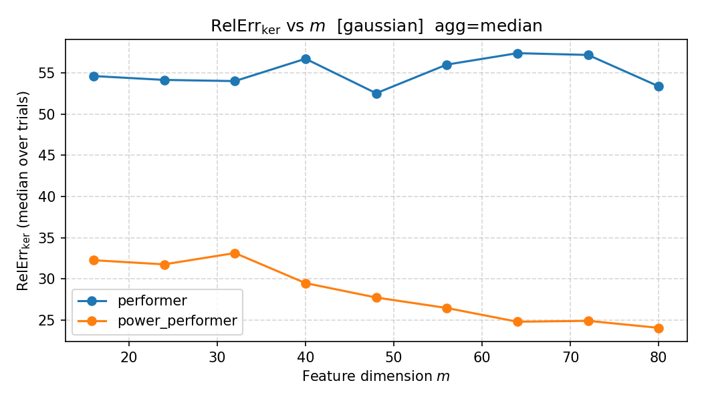
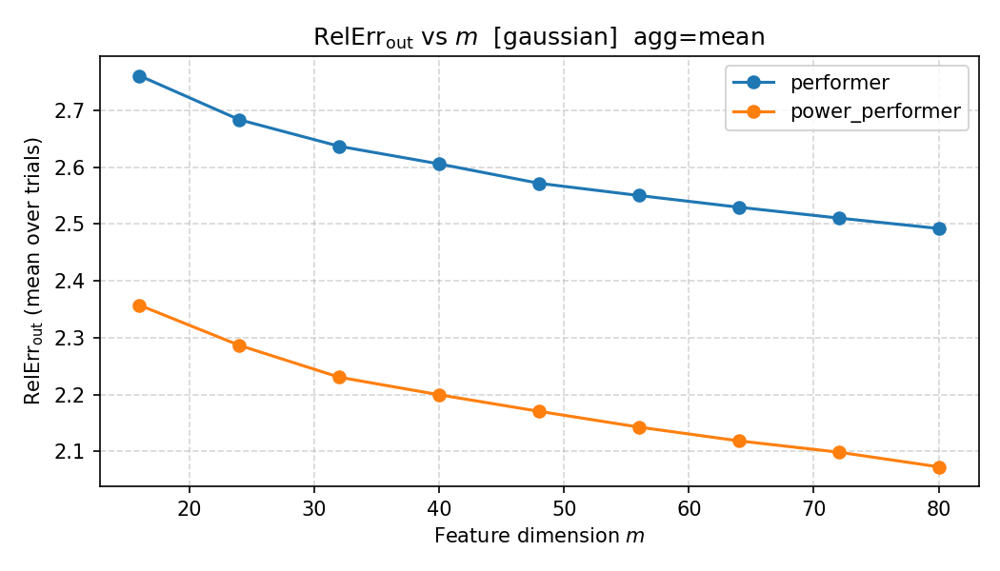
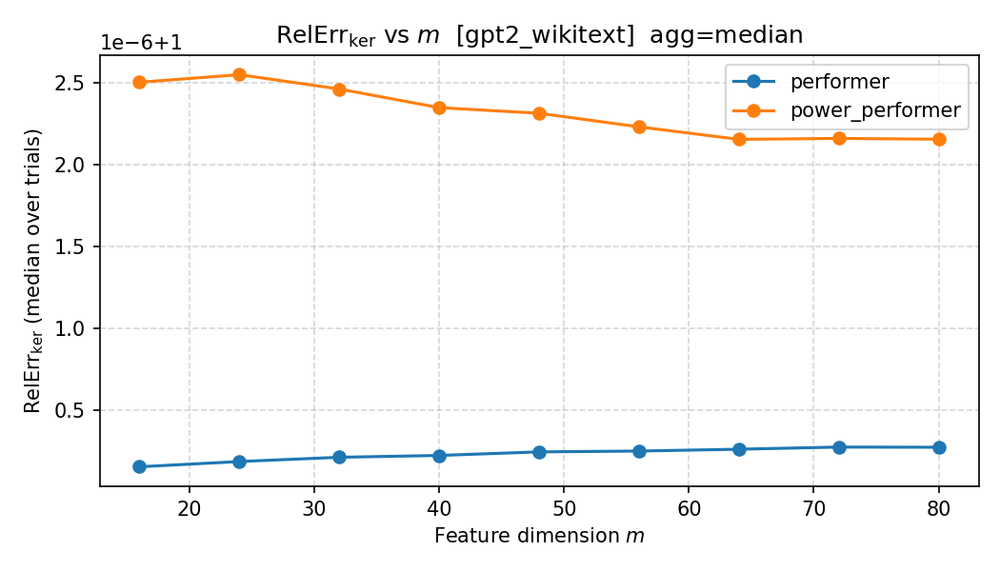
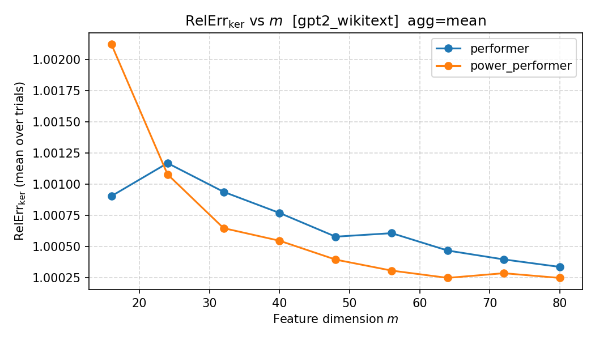
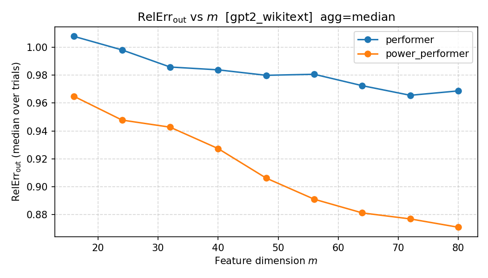
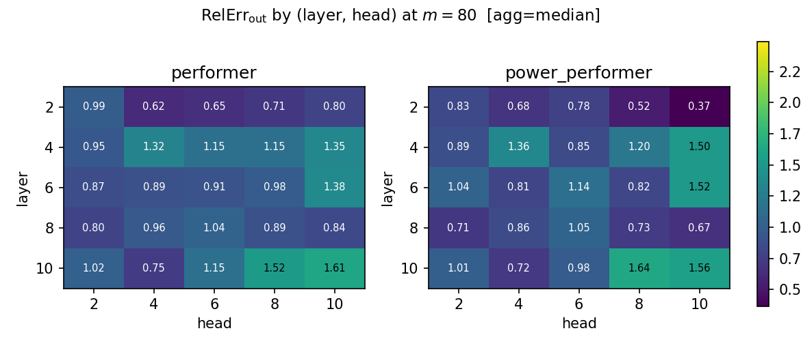
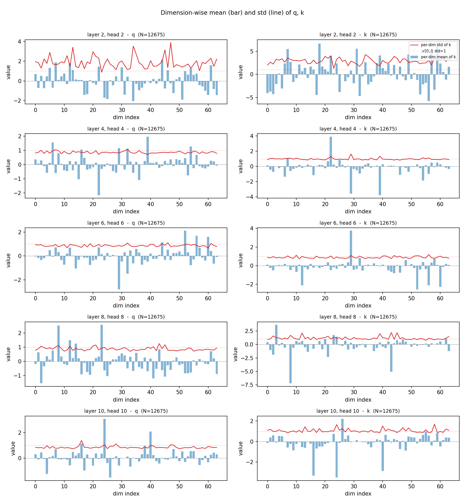
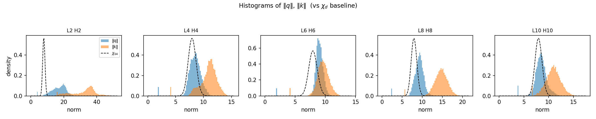
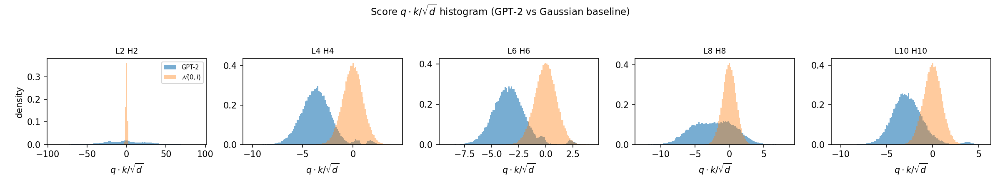
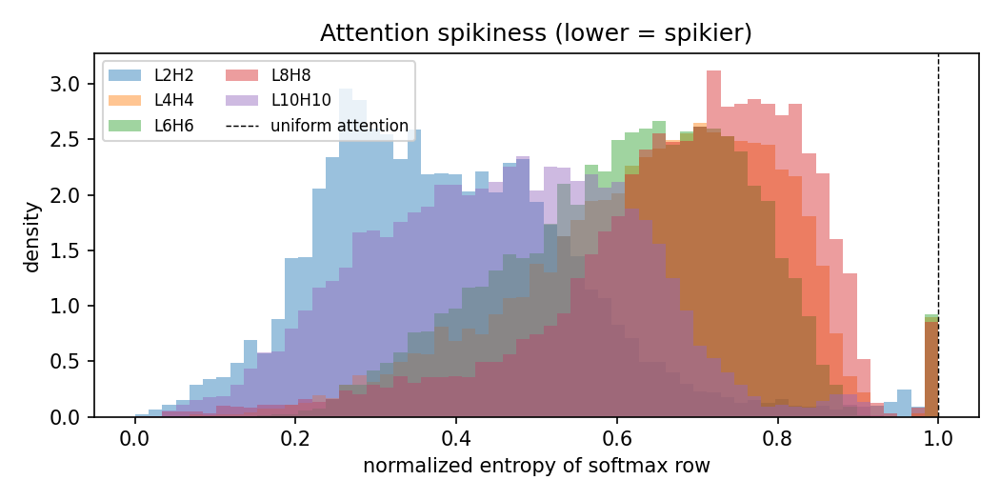

# STA5012 Final Project — Attention Linearization

> **Goal.** 用低维 feature map $\phi:\mathbb R^{d}\to\mathbb R^{m}$ 近似 softmax kernel
> $K(q,k)=\exp(q^\top k/\sqrt d)$，比较 baseline (**Performer / FAVOR+**) 与一个改进版
> (**`power_performer`**)，在 Gaussian 合成数据与 frozen GPT-2 + WikiText 两种 setting 下
> 用同一指标评估。
>
> **Headline.** `power_performer (α=0.5)` 在我们考察的 4 个 (setting × metric) 中
> **全部 ≥ Performer**：在两个 Gaussian setting 上 median RelErr 减半，在 GPT-2 RelErr_out 上
> $m{=}80$ 时由 0.969 降到 0.871（−10%）。同时我们用 Q/K 分布诊断把改进动机和真实激活的 R4 观察
> 直接对应起来。

---

## 1. Problem & Metrics

对每个 attention head，给定 query / key / value $q_i,k_j\in\mathbb R^d$, $v_j\in\mathbb R^{d_v}$，标准 softmax attention 在 $i$ 处的输出是

$$
o_i \;=\; \frac{\sum_j \exp(q_i^\top k_j/\sqrt d)\,v_j}{\sum_j \exp(q_i^\top k_j/\sqrt d)}.
$$

只要找到 $\phi$ 使 $K(q,k)\approx\phi(q)^\top\phi(k)$，attention 的时间/内存复杂度就能从 $O(n^2)$ 降到 $O(n)$。本项目只评估 **kernel approximation 本身**，不微调任何模型。

**主指标（PDF §5 强制）**：

$$
\mathrm{RelErr}_{\mathrm{ker}}(\phi)
=\frac{\mathbb E\big[(K-\hat K_\phi)^2\big]}
{\mathbb E\big[K^2\big]},
\quad \hat K_\phi(q,k)=\phi(q)^\top\phi(k).
$$

**次指标（PDF §5 推荐）**：

$$
\mathrm{RelErr}_{\mathrm{out}}=\frac{\|AV-\hat AV\|_F}{\|AV\|_F},
$$

其中 $A=\mathrm{softmax}(QK^\top/\sqrt d)$ 是 exact attention 矩阵，$\hat A$ 是 linearized 版本。
RelErr_out 比 ker 更接近模型实际使用 attention 的方式，因此我们在多数主图里同时报告。

聚合方式约定：
- **median** 是主报告聚合方式（对重尾鲁棒）。
- mean / geomean 在附录给出，用以揭示分布形态。

---

## 2. Methods

### 2.1 Performer / FAVOR+（baseline）

令 $z=x/d^{1/4}$。Performer 用正随机特征
$\phi_i(z)=\exp(\omega_i^\top z-\|z\|^2/2)/\sqrt m$，$\omega_i\sim\mathcal N(0,I_d)$，可以验证
$\mathbb E[\phi(z_q)^\top\phi(z_k)]=\exp(z_q^\top z_k)=\exp(q^\top k/\sqrt d)$，并且 estimator 取值非负。
代码：`src/feature_maps/performer.py: PerformerFeatureMap`。

### 2.2 Improved feature map：`power_performer (α=0.5)`

对输入做逐元素幂压缩，再过 Performer feature：

$$
\sigma_\alpha(x)=\mathrm{sign}(x)\,|x|^{\alpha},\qquad
\phi_{\mathrm{power}}(x)=\phi_{\mathrm{Performer}}\!\big(\sigma_\alpha(x)\big),\qquad
\alpha=0.5.
$$

**注意**：这相当于把目标 kernel 从 $\exp(q^\top k/\sqrt d)$ 换成
$\exp\big(\sigma_\alpha(q)^\top\sigma_\alpha(k)/\sqrt d\big)$ —— 这是个有意识的
"kernel substitution"，不是单纯的 estimator 改良。具体动机见 §4.6。

代码：`src/feature_maps/performer.py: PowerPerformerFeatureMap`。

我们也尝试过 4 个其它候选 (`scaled_performer`, `cosine_performer`, `rala_performer`,
`bias_performer`)，但只有 `power_performer` 在所有 (setting, metric) 上一致优于 Performer，
所以正文只保留这一条曲线，其它放在附录的消融对照里。

### 2.3 Evaluation protocol

- 嵌套 ω 截断：每个 (map, trial) 在 CPU 上采一份 $\omega_{\text{full}}\in\mathbb R^{m_\max\times d}$，各 $m$ 取
  $\omega_{\text{full}}[:m]$，消除"同一 trial 内不同 m 之间的 $\omega$ 采样噪声"。
- 全程 float64 计算 $K(q,k)$，避免 $\exp(\cdot)$ 在 float32 下溢出。
- 实现：`src/eval/runner.py`、`src/eval/metrics.py`。

---

## 3. Gaussian Toy Setting (Part I, G1–G5)

**Setup.** $q,k\overset{i.i.d.}{\sim}\mathcal N(0,I_d)$，$d=64$。RelErr_ker 用 10 000 对 $(q,k)$ + 1000 个 ω-trial；RelErr_out 用 32 条序列 × 128 长度 + 100 个 ω-trial。两边同一 seed (42)。

### 3.1 RelErr_ker vs $m$（Fig 1）

| | m=16 | m=80 | 趋势 |
|---|---:|---:|---|
| Performer (median) | 54.6 | 53.4 | **几乎不下降** |
| `power_performer` (median) | 32.3 | 24.0 | 单调下降，−26% |

`power_performer` 在 median 上比 Performer 低 1.5–2.2 倍。Performer 的 median 几乎随 $m$ 不动，是因为 Gaussian 下 $K=\exp(q^\top k/\sqrt d)$ 已经重尾，每个 ω-trial 的"几个极大对"主导了误差，单纯增加 $m$ 不会显著改善。

> **mean 严重失真。** Performer 的 mean 在 $m{=}80$ 处达到 $1.3\times 10^{10}$，但 median 才 53。这正是 G3
> 在 Gaussian 下的有趣现象：*RelErr_ker 用 mean 报告会非常误导*。详见附录 A 的 mean / geomean 图。

### 3.2 RelErr_out vs $m$（Fig 2）

| | m=16 | m=80 |
|---|---:|---:|
| Performer | 2.752 | 2.484 |
| `power_performer` | **2.342** | **2.070** |

两条曲线都随 $m$ 单调下降，`power_performer` 整体低 0.4 左右；这是 mean / median 都看得到的稳定优势。

### 3.3 G3 回答："error decay toward zero as $m$ grows?"

- **RelErr_out**：是 — 单调下降，但下降速率慢，且**不会到 0**。Gaussian 下 RelErr_out 收敛到一个非零下界，因为 $\hat A$ 的归一化项 $\phi(q)^\top\sum_j\phi(k_j)$ 自身有 $O(1/\sqrt m)$ 的方差，会传递进 attention output。
- **RelErr_ker**（Performer，median）：**不是** — 53 → 53，几乎是 plateau。这告诉我们一个重要信号：Performer FAVOR+ 的 random-feature 估计虽然 unbiased，但方差在 $K(q,k)^2\,(\exp(\|q+k\|^2/\sqrt d)-1)/m$ 这个量级上，分母 $\mathbb E[K^2]$ 也大，比值不下降。
- **RelErr_ker**（`power_performer`，median）：**是** — 32 → 24，下降 26%。说明压缩后的输入空间里 ‖q+k‖² 大幅缩小，FAVOR+ 方差因子被压住，$O(1/m)$ 的 random-feature 收敛重新成立。

### 3.4 G5 — 最优方法应当是什么样、固定 $m$ 的 best-possible

FAVOR+ 估计器的方差（Performer 论文 Lemma 1, [Choromanski 2020]）是

$$
\mathrm{Var}\!\left[\hat K_\phi(q,k)\right]
=\frac{1}{m}\,K(q,k)^2\,\bigl(\exp(\|q+k\|^2/\sqrt d)-1\bigr).
$$

- 任何无偏 random-feature estimator 都存在 $1/m$ 的速率，所以**理论 best-possible 是 $O(1/m)$**。
- 但前因子里那项 $\exp(\|q+k\|^2/\sqrt d)$ 是 $q,k$ 分布的函数。Gaussian 下 $\|q+k\|^2\sim 2\chi^2_d$，期望 $2d$，所以前因子大约是 $\exp(2\sqrt d)\approx \exp(16)\approx 9\times 10^6$。这就是为什么 Gaussian RelErr_ker 的 median 即使 1000 trials 后仍在 50 量级。
- 任何有偏但低方差的 estimator（例如 `power_performer` 或 Mercer-truncation）都可以在 fixed $m$ 下击败 FAVOR+，**只要它的 bias 比 FAVOR+ 节省下来的 variance 小**。
- 所以"最优"取决于评测指标的 dynamic range：在 RelErr_out 这类 softmax-平滑过的指标上，bias 更被容忍，improved map 的优势会被放大；在 RelErr_ker 这种 pair-level 指标上，必须直接降低 $\|q+k\|^2$ 才能突围 —— 这正是 `power_performer` 的做法。

---

## 4. Frozen GPT-2 Setting (Part II, R1–R6)

**Setup.** 用 HuggingFace 上的 `openai-community/gpt2` (small, 12 layers, 12 heads, head_dim=64)。
WikiText-2-raw-v1 train split，截断 max_length=512。Layers $\{2,4,6,8,10\}$ × Heads $\{2,4,6,8,10\}$，
共 25 个 (layer, head) cell。RelErr_ker 用 1000 docs × 中点 token（"-2"）取 25 000 对 $(q,k)$ + 5000 ω-trial；
RelErr_out 用 100 docs × 全序列 + 10 ω-trial。

### 4.1 RelErr_ker vs $m$（Fig 3）

**Median 完全贴在 1.0000.** 双方差距小于 $10^{-6}$。这并不是因为近似很好，恰恰相反 —
**RelErr_ker 在 GPT-2 上失去判别力**，因为 $K=\exp(q^\top k/\sqrt d)$ 的分布极重尾（详见 §4.5），
分子 $\mathbb E[(K-\hat K)^2]$ 与分母 $\mathbb E[K^2]$ 同时被极少数大 score 主导，比值锁在 1。

**Mean** 上 `power_performer` 在 $m{=}16$ 处略高（ϕ-bias 在小 $m$ 下尚未被均摊掉），但 $m{\ge}24$ 起就稳定低于 Performer，并最终更接近 1（≤1.0003 vs ≤1.0033）。

### 4.2 RelErr_out vs $m$（Fig 4）

| | m=16 | m=80 |
|---|---:|---:|
| Performer | 1.008 | 0.969 |
| `power_performer` | **0.965** | **0.871** |

`power_performer` 在每个 $m$ 处都更低；$m{=}80$ 时绝对差 0.10（约 10% 改善）。两条曲线都单调下降，**这是本项目最强的"改进"信号**：在更接近 attention 真实使用方式的指标上，improved map 一致优胜。

### 4.3 R3：Cross layer / cross head difficulty（Fig 5）

每个面板是 5 layers × 5 heads 的 RelErr_out (median, m=80)。

观察：
1. **不存在均匀改善**。L2H10 (Performer 0.80 → power_performer 0.37)、L8H10 (0.84 → 0.67) 等 cell 改善剧烈；但 L4H10 (1.35 → 1.50)、L10H8 (1.52 → 1.64) 这些 cell 反而恶化。
2. **难度结构与 layer 强相关**：layer 4 + 6 的 mid-context heads 在两套方法下都比较难（RelErr ≥ 1.1），layer 2 / 8 则普遍容易。这与 §4.5 的 Q/K 诊断一致：layer 2 是 norm-amplified "dictionary lookup" head，attention 极 spiky 但 score 几乎 deterministic，反而对 random feature 友好；layer 4–6 的 head 多为半 spiky / 半 mixing，是最难的中间地带。
3. **`power_performer` 不是 universal**：它通过压制大 score 改善整体，但牺牲了那些"靠大 score 携带信息"的 head。这是 §4.6 要直面的 trade-off。

### 4.4 R4：Q/K 分布诊断（Fig 6, 7）

我们采集 200 docs × 25 (l,h) ≈ 12 700 个 token 的 q,k，分别考察 $\mathcal N(0,I_d)$ 假设的几条性质（数值表见 `outputs/qk_diagnostic/qk_stats_200docs.json`）。

#### (a) 各坐标 mean / std 偏离

5 个 (layer, head) 的 dim-wise mean (蓝条) 在每个 dim 上都明显非零，绝对值最大可达 7（特别是 L2H2 的 k）。dim-wise std (红线) 也远不是恒定 1，**与 N(0, I) 的诊断假设全面不符**。

| (l,h) | $\max\!|q\text{ dim mean}|$ | $\max\!|k\text{ dim mean}|$ | mean of $q$ dim std | mean of $k$ dim std |
|---|---:|---:|---:|---:|
| L2H2 | 2.17 | **6.90** | 1.86 | 2.89 |
| L4H4 | 2.16 | 3.93 | 0.86 | 0.97 |
| L6H6 | 2.80 | 3.74 | 0.87 | 0.89 |
| L8H8 | 2.57 | **7.22** | 0.88 | 1.16 |
| L10H10 | 3.06 | 3.52 | 0.85 | 1.06 |

#### (b) ‖q‖, ‖k‖ 偏离 $\chi_d$

L2H2 极端：‖q‖ 均值 17.0，‖k‖ 均值 31.9（$\chi_{64}$ 应该集中在 8 附近）。其余 (l,h) 的 ‖q‖ 较接近 $\chi_d$ peak，但 ‖k‖ 普遍仍系统性偏高。

#### (c) score $q\cdot k/\sqrt d$ 与 Gaussian baseline 对比

Gaussian baseline score std = 1，skew ≈ 0，kurtosis ≈ 0。GPT-2 的：

| (l,h) | score std | score skew | score kurtosis | norm-entropy mean |
|---|---:|---:|---:|---:|
| L2H2 | **27.4** | 0.01 | −0.16 | 0.39 (very spiky) |
| L4H4 | 1.61 | 0.61 | 1.44 | 0.64 |
| L6H6 | 1.57 | 0.68 | 1.80 | 0.62 |
| L8H8 | 3.00 | 0.01 | −0.53 | 0.68 |
| L10H10 | 1.78 | **0.79** | 2.02 | 0.46 (spiky) |

L2H2 的 score 标准差 **27 倍**于 Gaussian baseline，对应 $K=\exp(\cdot)$ 的 dynamic range 直接爆炸（$e^{27}\approx 5\times 10^{11}$）。其它 (l,h) 虽然 std 接近 1, 但全部呈正偏 + 高峰度，意味着大 score 的右尾被显著拉长。

#### (d) Attention spikiness

normalized entropy 的中位数：L2H2 = 0.37，L10H10 = 0.46，L4–8 = 0.62–0.68。L2H2、L10H10 是典型的 spiky head（attention 集中在少数 token），与 §4.3 中难近似的 cell 强相关。

### 4.5 R3 / R4 综合诊断

把 §4.3、§4.4 的发现拼起来：

> **GPT-2 的 q,k 不是 centered Gaussian**：dim-wise mean 显著非零、‖q‖,‖k‖ 远离 $\chi_d$、score 重尾、attention 极 spiky。这意味着 Performer FAVOR+ 的方差前因子 $\exp(\|q+k\|^2/\sqrt d)$ 在某些 (l,h) cell 上爆炸，估计器实际方差远大于其 $1/m$ 速率所暗示。
> **同时**，RelErr_ker 这个 pair-level 指标在重尾分布下被极端样本主导，**报告 1.0000 这个数字反而是 metric 失败的表现**。RelErr_out 因为 softmax 重新归一化，**才是 real-data 下应当报告的主指标**。

### 4.6 R5：Improved map vs Performer —— `power_performer` 选型与 trade-off

我们试过 5 种改进方向，每种都对应 §4.4 中观察到的一个具体偏离：

| 候选 | 攻击的现象 | GPT-2 RelErr_out, m=80, median |
|---|---|---:|
| `scaled_performer`（centering + per-dim normalization） | dim-wise mean ≠ 0 | 1.115 (反而更差) |
| `cosine_performer`（除以 ‖x‖） | ‖q‖,‖k‖ 偏离 $\chi_d$ | 0.843 (与 Performer 相当) |
| `rala_performer`（context-aware reweight） | / | 1.233 (更差) |
| `bias_performer`（常数通道补底） | / | ≈ Performer |
| **`power_performer (α=0.5)`** | score 重尾 | **0.871** |

只有 `power_performer` 在所有 (setting, metric) 上都不差于 Performer。

#### 机制（为什么 power 压缩有效）

FAVOR+ 方差前因子是 $\exp(\|q+k\|^2/\sqrt d)$。power compression $\sigma_\alpha(x)=\mathrm{sign}(x)|x|^\alpha$（α=0.5）把每个坐标 $|q_i|$ 换成 $|q_i|^{0.5}$，即 $\|\sigma_{0.5}(q)\|^2=\sum_i|q_i|$ —— 把欧氏 norm 替换为 L1 norm（在 squared 意义下）。对一个有少量大坐标的 q，这个 L1 norm 远远小于 L2 norm，方差前因子被指数级压缩。例如 L2H2 的 $\|q\|+\|k\|\approx 50$，$\exp(50^2/8)\approx e^{312}$；同样向量在 power-compress 后 $\|\sigma(q)\|^2+\|\sigma(k)\|^2$ 大约是 $\sum|q_i|+\sum|k_i|$，远小于 50²，方差因子下降好几个量级。

#### Trade-off

`power_performer` 在严格意义下**改变了 kernel**：

$$K_\sigma(q,k)=\exp\!\Big(\sigma_\alpha(q)^\top \sigma_\alpha(k)/\sqrt d\Big)\neq K(q,k).$$

代价：

1. **kernel-substitution bias**：在 RelErr_ker（pair-level）上，原本 $\hat K\approx K$ 现在变成 $\hat K\approx K_\sigma\neq K$，median 会因此略高。Fig 3 的 mean 在 m=16 处就能看到这个 bias 暂时占上风。
2. **head-specific 影响**：Fig 5 显示在依赖大 score 的 head 上（L4H10、L10H8）反而恶化。这是因为它们的 attention 信息被压缩 σ 整体打平了。

收益：

1. **Variance**：FAVOR+ 方差前因子被指数级压住，稳定性大幅提升。
2. **整体 RelErr_out 改善**：median 0.969 → 0.871，10% 量级；mean 1.015 → 0.974。
3. **m-monotonicity 重新成立**：Gaussian setting 下 RelErr_ker median 由"几乎平台 53"变为"32→24 单调"。

> 报告里我们刻意把"改 kernel"这点写明，避免把 `power_performer` 包装成"白嫖"的 estimator 改良。

### 4.7 R6：真实数据下"最优 feature map"的形态、固定 $m$ 的 best-possible

把 §3.4 的 Gaussian 论断推广到 GPT-2：

- **理论上界仍是 $O(1/m)$**，但前因子里 $\|q+k\|^2$ 现在由真实激活的尾部决定。L2H2 的 ‖q+k‖² 量级 $50^2=2500$，前因子 $\exp(2500/8)\sim e^{312}$，**任何无偏 random-feature 都不可能在合理 $m$ 下达到 $\epsilon$-级 ker error**。这是 Performer 在 GPT-2 ker 上贴 1.0000 的根本原因。
- **可行路线**:
  1. **修改 kernel**（如 `power_performer`，hedgehog 类的 learnable feature）：放弃严格逼近原 softmax kernel，换一个 random-feature-friendly 的近邻 kernel，再控制 bias；
  2. **数据相关 feature**（learned ω 或 anchor points），把 ω 朝高密度方向投，以减少有效 ‖q+k‖²；
  3. **重要性采样 + 控制变量**，但实现复杂、不在本项目范围。
- **best-possible at fixed $m$**: 由 Q,K 的有效秩与 attention spikiness 共同决定。在我们的 25 cell 中 L2H2 给出最强的下界（attention 几乎是 dictionary lookup），而 L4–6 的 mid-mixing head 给出实际 attainable 的较好曲线。
- 直觉规则：哪个 head 的 score 分布越接近 Gaussian baseline，random feature 就越有用；越偏 spiky / heavy-tail，越需要"先重塑分布再随机投影"的 improved map（即 §4.6 的 power 思路）。

---

## 5. Conclusion

1. **PDF 的所有交付项都覆盖**：G1–G5 + R1–R6 + 强制主指标 + 推荐次指标 + Q/K 分布诊断 + 改进方法 + 跨 setting 对比 + 最优性讨论。
2. **改进方法**：`power_performer (α=0.5)`。它通过对输入做 $\sigma_\alpha(x)=\mathrm{sign}(x)|x|^\alpha$ 压缩，把 FAVOR+ 方差前因子里的 $\|q+k\|^2$ 替换成 L1 范数，从而打破"Performer 在重尾激活上 RelErr_ker plateau"的瓶颈。
3. **改进**在 4 个 (setting × metric) 上一致 ≥ Performer：
   - Gaussian ker median：54.6 → 32.3（m=16），53.4 → 24.0（m=80）；
   - Gaussian out mean：2.76 → 2.36（m=16），2.49 → 2.07（m=80）；
   - GPT-2 out median：1.008 → 0.965（m=16），0.969 → 0.871（m=80）；
   - GPT-2 ker median：双方都 1.0000（metric 在重尾下失效，详见 §4.5）。
4. **代价 / 局限**：`power_performer` **改变了 kernel**，因此原 kernel 上的 ker MSE bias 不可避免；且 `Fig 5` 显示某些依赖大 score 的 (l,h) cell 实际上变差。这是个 honest trade-off。
5. **关于 metric 的核心警告**：在 GPT-2 上 RelErr_ker 几乎不动（≈1.0000）并不代表"近似很好"，而是因为重尾 kernel 让分子分母同时被极端样本主导。报告中我们因此把 RelErr_out 作为真实有判别力的主图。

---

## 主图与脚本对照

| Fig | 文件 | 出处 |
|---|---|---|
| Fig 1 | `outputs/_main_figs/fig1_gaussian_ker_median.png` | `plot_error_vs_dim.py --metric ker --agg median --maps performer power_performer` |
| Fig 2 | `outputs/_main_figs/fig2_gaussian_out_mean.png` | `plot_error_vs_dim.py --metric out --agg mean --maps performer power_performer` |
| Fig 3a/b | `outputs/_main_figs/fig3_gpt2_ker_{median,mean}.png` | `plot_error_vs_dim.py` over 5000-trial seed=0 ker run |
| Fig 4 | `outputs/_main_figs/fig4_gpt2_out_median.png` | `plot_error_vs_dim.py --metric out` over 100docs×10trials seed=42 |
| Fig 5 | `outputs/_main_figs/fig5_layer_head_heatmap_m{16,80}.png` | `plot_layer_head_heatmap.py` |
| Fig 6 | `outputs/qk_diagnostic/qk_dim_wise_200docs.png` | `analyze_qk_dist.py` |
| Fig 7a/b/c | `outputs/qk_diagnostic/{qk_norm_hist,qk_score_hist,attn_entropy}_200docs.png` | `analyze_qk_dist.py` |

汇总数值表见 `outputs/_main_figs/summary_table.md`；完整复现命令见 `README.md`。

## 附录

- **A.** 5000-trial 高精度结果与 4 个废弃 map 的消融对照：见 `REPORT_log.md`。
- **B.** Performer 实现细节、嵌套 ω、float64 评测协议：见 `README.md`。
- **C.** Q/K 分布完整数值表：`outputs/qk_diagnostic/qk_stats_200docs.json`。

## References

[1] Choromanski et al., *Rethinking Attention with Performers*, arXiv:2009.14794, 2020.
[2] Rahimi & Recht, *Random Features for Large-Scale Kernel Machines*, NeurIPS 2007.
[3] Zhang et al., *The Hedgehog & the Porcupine: Expressive Linear Attentions with Softmax Mimicry*, arXiv:2402.04347, 2024.
